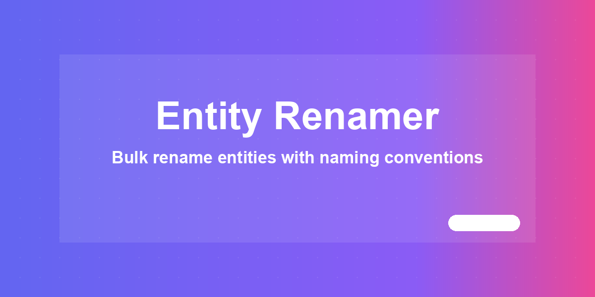
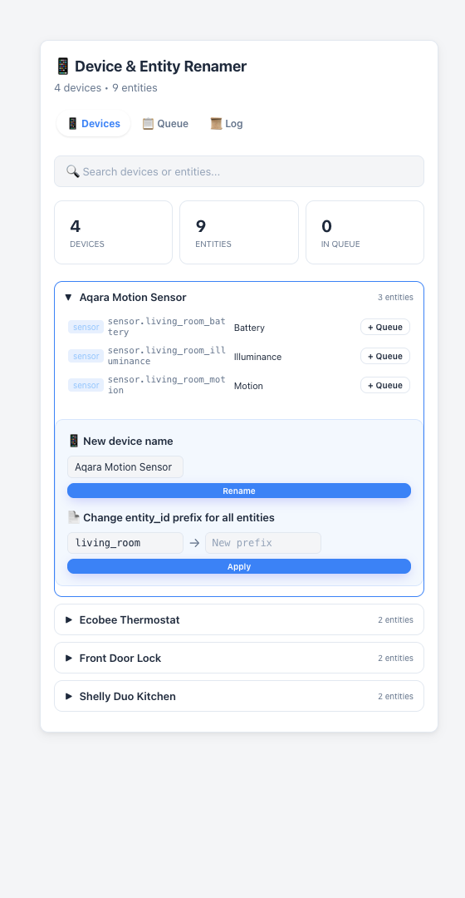
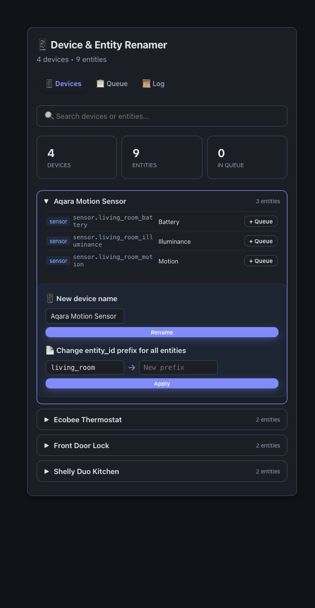

# Entity Renamer



Bulk-rename Home Assistant devices and entities — `entity_id`, friendly names,
or a whole device's entities at once by prefix — with an impact preview that
shows exactly which automations, scripts, scenes, and dashboards reference an
entity before you touch anything.

[](https://github.com/MacSiem/ha-entity-renamer/releases) [](LICENSE)

## How it works

1. **Devices and entities from the registries.** On load, the card fetches
   every device (`config/device_registry/list`) and entity
   (`config/entity_registry/list`), groups entities under their parent
   device, and lets you search across both.
2. **Queue renames without touching anything yet.** Expand a device to add an
   entity to the queue with a new `entity_id` and/or a new friendly name,
   rename the device's display name, or use **Change prefix** to bulk-rename
   every entity under a device that shares a common `object_id` prefix (e.g.
   `sensor.old_*` → `sensor.new_*`).
3. **Analyze impact before applying.** The Queue tab's **Analyze Impact**
   button calls `search/related` for each queued entity to list the
   automations, scripts, and scenes that reference it, then scans every
   Lovelace dashboard (`lovelace/dashboards/list` + `lovelace/config`) for raw
   references — so you know what needs a manual follow-up edit before you
   rename.
4. **Apply with confirmation.** **Apply Changes** shows a confirmation
   dialog, then writes the changes via `config/entity_registry/update`
   (entity_id and/or name) and `config/device_registry/update` (device
   display name), and logs every attempt — success or failure — to the Log
   tab.

### What is automatic vs. manual

| Automatic | Manual (optional) |
|---|---|
| Loading every device and entity from the registries | Choosing which entities/devices to queue |
| Impact scan across automations, scripts, scenes, dashboards | Editing the automations/scripts/dashboards a rename affects — the card does not rewrite YAML or Lovelace config for you |
| Rename confirmation dialog before any registry write | Bulk prefix rename — you choose the old/new prefix per device |
| Rename history log kept in your browser | Restarting Home Assistant after `entity_id` changes (recommended) |

## Screenshots

| Light | Dark |
|---|---|
|  |  |

*The Devices tab: expand a device to see its entities, queue a rename, or
bulk-rename by prefix. Dark mode follows your Home Assistant theme
automatically.*

## Installation

1. Open HACS → Custom repositories.
2. Add `https://github.com/MacSiem/ha-entity-renamer` as category
   **Dashboard** (Lovelace plugin).
3. Install **Entity Renamer** and reload your browser.

## Quick start

```yaml
type: custom:ha-entity-renamer
```

That's it — no options are required. An optional **Title** field is
available in the card's visual editor.

## Features

- **Device & entity browser** — search across devices and entities, grouped
  by device.
- **Entity rename** — change `entity_id` (object_id), friendly name, or both,
  per entity.
- **Device rename** — rename a device's display name.
- **Bulk prefix rename** — rename every entity under a device that shares a
  common `object_id` prefix in one action.
- **Impact analysis** — see every automation, script, scene, and dashboard
  that references a queued entity before you rename it.
- **Rename history** — a log of every rename attempt (success/error), kept in
  your browser.

## FAQ

**Does this rename entities immediately when I add them to the queue?**
No. Adding an entity or device to the queue only stages the change — nothing
is written to Home Assistant until you click **Apply Changes** and confirm.

**Will this update my automations and dashboards automatically?**
No. The card shows you which automations, scripts, scenes, and dashboards
reference a renamed entity so you know what to fix, but it does not rewrite
that YAML or Lovelace config for you.

**Do I need to restart Home Assistant after a rename?**
For friendly-name-only changes, no. For `entity_id` changes, a restart is
recommended so every integration picks up the new ID.

**Does this send data anywhere?**
No. Everything runs locally in your browser against your Home Assistant
instance — no telemetry, no analytics, no CDN-hosted assets. The only
external links in the card are the optional Buy Me a Coffee / PayPal support
buttons, which only load anything if you click them.

## Changelog

See [CHANGELOG.md](CHANGELOG.md).

## Support

- [Buy Me a Coffee](https://buymeacoffee.com/macsiem)
- [PayPal](https://www.paypal.com/donate/?hosted_button_id=Y967H4PLRBN8W)

## License

MIT, see [LICENSE](LICENSE).
